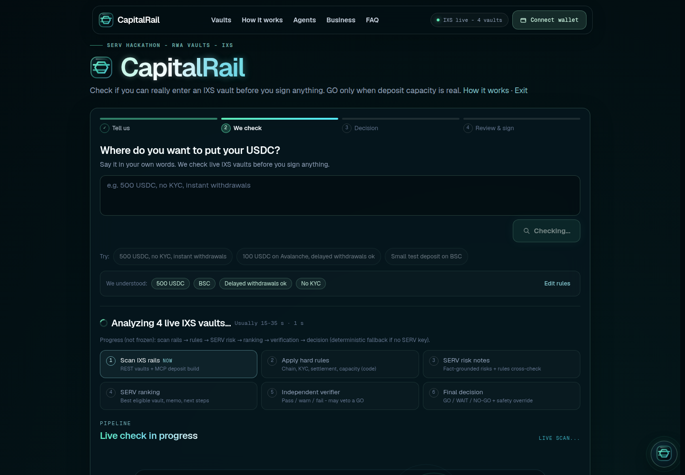
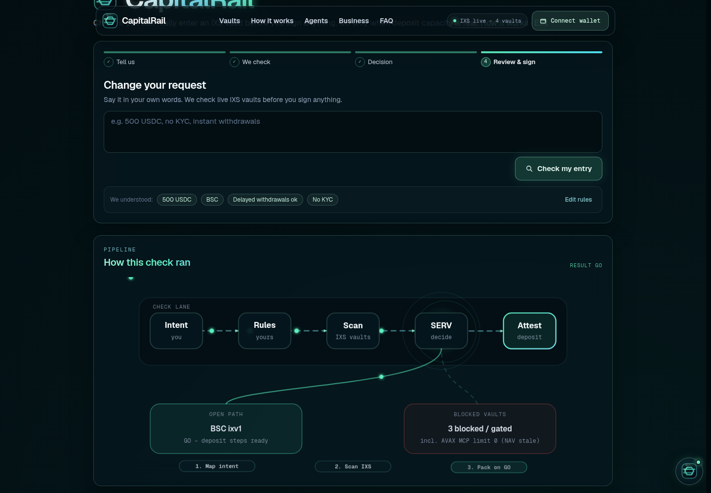
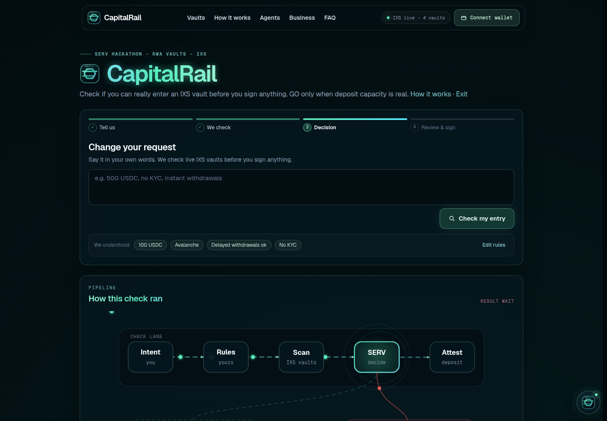
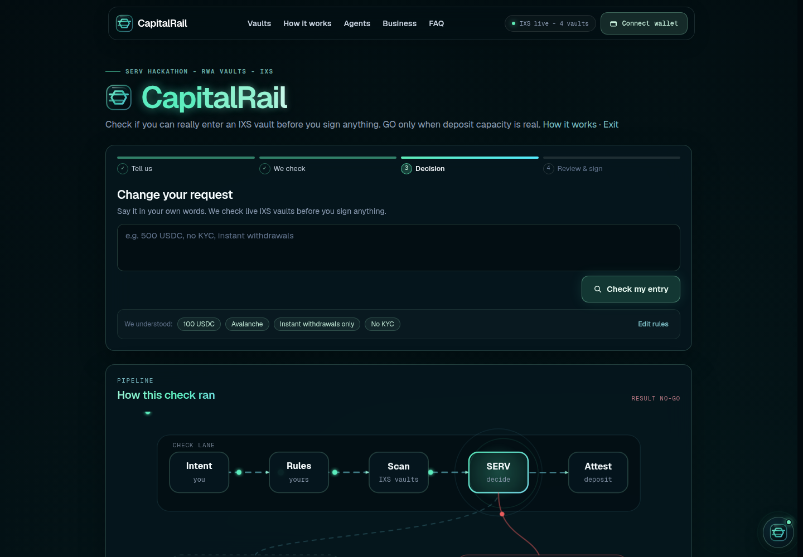
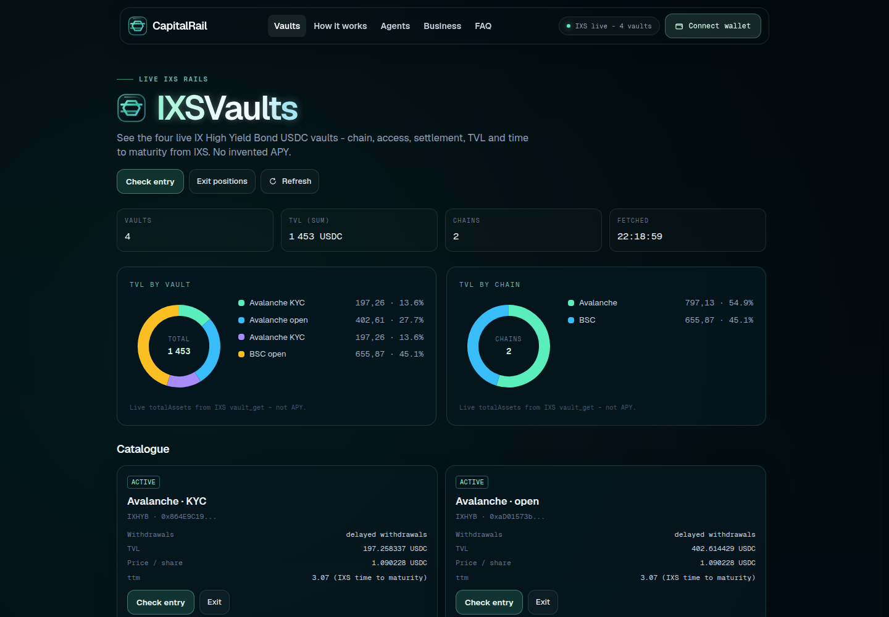

# CapitalRail

IXS entry preflight for the **SERV Hackathon Edition 01** (RWA Vaults track, partner IXS).

Before any capital moves, CapitalRail checks the live IXS vaults (capacity, whitelist / KYC, withdrawal mode, balance) and answers **GO / WAIT / NO-GO** with reasons and fact-grounded risk notes. Only on GO, and only for your connected wallet, it prepares **unsigned** approve + deposit transactions that you sign yourself.

Rules are code; judgment is SERV; the verifier may veto a GO, never unlock one. When MCP deposit limit is `0` (often NAV staleness on Avalanche HYB - not permanently closed), CapitalRail returns **WAIT** and refuses unsafe entry.

| | |
| --- | --- |
| Live | https://capitalrail.ozc.fr |
| Repo | https://github.com/ThibautMilville/CapitalRail |
| License | MIT |
| Demo scenarios | [docs/demo-scenarios.md](./docs/demo-scenarios.md) |




## Architecture

```
Browser (guided UI) ──► POST /api/intent (optional free text → mandate)
                    ──► POST /api/preflight
                              │
                              ├─ scanRails: IXS REST GET /vaults + MCP vault_get / whitelist / build deposit
                              ├─ rulesFilter (code): eligible + most blocking reason → GO / WAIT / NO-GO class
                              ├─ SERV risk (small): fact-grounded notes + rules cross-check
                              ├─ SERV ranking (small): best eligible vault, memo, next steps
                              ├─ SERV verification (fast): pass / warn / fail (hard fail vetoes GO)
                              └─ safety override (code): re-check final GO; align memo/steps with decision
```

Stack: Next.js App Router, React, TypeScript, Tailwind, wagmi/viem, zod, OpenAI-compatible SERV client, IXS REST + MCP.

Folder map: `src/features/preflight` (scan, decide, UI), `src/shared/ixs` (REST/MCP), `src/shared/serv` (client, schemas, prompts), `src/app/api/*`.

## IXS data sources

| Source | What CapitalRail uses |
| --- | --- |
| REST `GET https://api-v2.ixs.finance/vaults` | Vault list (4 HYB USDC vaults: BSC/Avalanche × open/KYC) |
| MCP `https://api-v2.ixs.finance/mcp` | `vault_get`, `vault_check_whitelist`, `vault_build_request_deposit` (capacity / limit 0), exit tools for redeem |
| Ops facts (`src/shared/ixs/ops-facts.ts`) | Cutoff 5:00 PM SGT, limit-0 = NAV stale meaning, Avalanche min 100 USDC - injected into SERV payloads |

A `User-Agent` header is required on IXS calls. Settlement for async HYB: daily cutoff Singapore business days; redemptions have no separate claim step (operator finalizes).

## Where SERV sits (rules = code, judgment = SERV)

| Step | Who | Role |
| --- | --- | --- |
| Rules filter | **Code** (authoritative) | Chain, KYC, settlement, capacity → outcome class GO / WAIT / NO-GO |
| Risk notes | **SERV** | Fact-grounded risks + independent eligibility cross-check |
| Ranking + memo | **SERV** | Rank eligible rails, write memo and next steps |
| Verifier | **SERV** | Pass / warn / fail; soft fails warn; **code-confirmed hard fail vetoes a GO, never unlocks one** |
| Safety override | **Code** | Last word on GO; rewrite memo/steps if decision is not GO |

Without `SERV_API_KEY`, each SERV step uses a deterministic fallback with the same shape (app stays usable). Trace shows source per step (code / SERV / fallback).

## Guardrails

- **No unsigned txs unless GO** - and only for the checked connected wallet (demo `0x...0001` = preview, never a tx pack).
- **Memo and next steps always match the final decision** - after verifier veto or safety override, CapitalRail regenerates copy so it never says "proceed" / "sign" on WAIT or NO-GO.
- **Sign UI is hidden** when decision is not GO.
- SERV cannot invent vault ids or numbers absent from the payload; every GO is re-checked by code.
- Rate-limited API; no custody; nothing signed server-side.

## Reproduce GO / WAIT / NO-GO

Exact prefs and curls: [docs/demo-scenarios.md](./docs/demo-scenarios.md).

### GO (BSC, delayed ok)

**Disconnect any wallet** (preview `0x…0001`). Free text: `100 USDC on BSC, no KYC, delayed withdrawals ok`  
Prefs: amount `100`, chain BSC (`56`), KYC off, sync off. A connected underfunded wallet is honest NO-GO.



Expect: `decision=GO` when the open BSC rail builds. Soft SERV verifier notes warn only; hard veto needs a code-invalid rail. Unsigned txs only with a real funded wallet.

### WAIT (Avalanche, deposit limit 0)

Free text: `100 USDC on Avalanche, no KYC, delayed ok`  
Prefs: amount `100`, chain Avalanche (`43114`), KYC off, sync off.



Expect: `WAIT` while MCP limit is 0. Memo: `Final decision: WAIT`. No sign CTA, no tx pack.

### NO-GO (hard block or verifier veto)

Hard block: Avalanche + **instant withdrawals required** (`requireSyncSettlement: true`) → settlement conflict → `NO-GO`.  
Or: GO path + live verifier hard fail → veto → memo rewritten to `Final decision: NO-GO`.



### Vaults catalogue



## For agents

| | |
| --- | --- |
| OpenAPI 3 | [`/openapi.yaml`](./public/openapi.yaml) (live: https://capitalrail.ozc.fr/openapi.yaml) |
| UI | Section `#agents` |
| Tools | `POST /api/preflight`, `POST /api/intent` |

**Agent rule:** when `decision` is WAIT / reason `DEPOSIT_LIMIT_ZERO`, do not force a deposit. Wait for a successful MCP build.

```bash
npm run mcp   # CAPITALRAIL_BASE_URL defaults to https://capitalrail.ozc.fr
```

## API (quick)

```bash
BASE_URL=https://capitalrail.ozc.fr

curl -s "$BASE_URL/api/health"

curl -s -X POST "$BASE_URL/api/preflight" \
  -H 'Content-Type: application/json' \
  -d '{
    "walletAddress": "0x0000000000000000000000000000000000000001",
    "amount": "100",
    "preferences": {
      "allowKyc": false,
      "requireSyncSettlement": false,
      "preferredChainId": 56
    }
  }'

curl -s -X POST "$BASE_URL/api/intent" \
  -H 'Content-Type: application/json' \
  -d '{ "message": "100 USDC on BSC, no KYC, delayed withdrawals ok" }'
```

Placeholder wallet `0x...0001` → `preview: true`, no tx pack.

## Getting started

```bash
git clone https://github.com/ThibautMilville/CapitalRail.git
cd CapitalRail
cp .env.example .env.local
# optional: SERV_API_KEY from https://console.openserv.ai
npm install && npm run build && npm run start
```

Checks: `npx tsc --noEmit`, `npm run lint`, `npm test`.

## Safety

- No private keys on the server, nothing signed server-side, no custody.
- IXS MCP only returns unsigned calldata.
- SERV cannot invent vault facts, cannot unlock a vault the rules block, and every GO is re-checked by code.
- Not financial advice.
